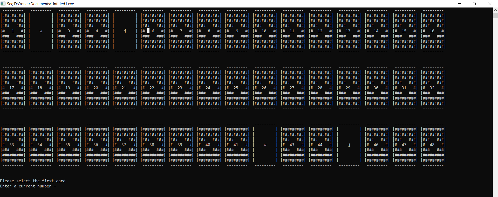

# BasicCardGame_C

This is a simple card matching game. In this game, you need to match two cards with the same number. If you match them, they will remain open; otherwise, they will be turned back. The objective is to match all the cards with the minimum number of turns.

## How to play

1. Run `main.py` to start the game.
2. Click on any card to reveal its number.
3. Click on another card to check if it matches with the first one.
4. If the cards match, they will remain open; otherwise, they will be turned back.
5. Keep matching cards until all cards are open.

## Acknowledgments

This game was created as a fun project for learning the basics of c++. Feel free to use and modify the code as you wish.

